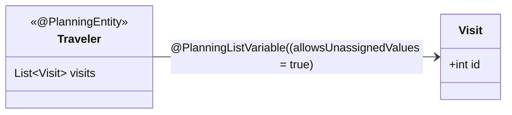

This is an implementation of the roadtrip problem in Java using Timefold.

For more advanced examples, check out the [Timefold Quickstarts Repository](https://github.com/TimefoldAI/timefold-quickstarts).
This project leans towards the [Vehicle Routing Quickstart](https://github.com/TimefoldAI/timefold-quickstarts/tree/stable/java/vehicle-routing).

## Analysis

### Assumptions

- I have assumed that the distances and fuel costs are not directional. Ex. entry `1 37 60 5` means both 1->37 and 37->1 have _a distance 60_ and _fuel cost of 5_.
- I have assumed that the roadtrip is from 1->100 and _not a roundtrip (1->100->1)_.
- My assumption was that we would prefer to take a detour to see more cities, before minimizing our distance. (It's a roadtrip after all :-).

Both these assumptions could easily be implemented if requested ;)

### Domain model

In this case, I have chosen to model the domain in a very simple way and have moved everything related to distance/fuel calculation to a helper class. 

### Constraints

Note: This is implemented in class `RoadTripConstraintProvider`, which contains some additional documentation.

- HARD: Do not use more fuel than the budget (73)
- MEDIUM: Try to visit as many locations as possible
- SOFT: Minimize travel distance

## Tech

### Technologies used

- [Timefold Solver](https://docs.timefold.ai/timefold-solver/latest/introduction), an Open Source AI Solver.
- [JBang](https://www.jbang.dev/documentation/guide/latest/index.html), a tool which helps create single Java file scripts with dependencies.

### Running the application

- You need to install JBang.
- Go to the correct folder.
- Execute `jbang Dec02Roadtrip.java`

