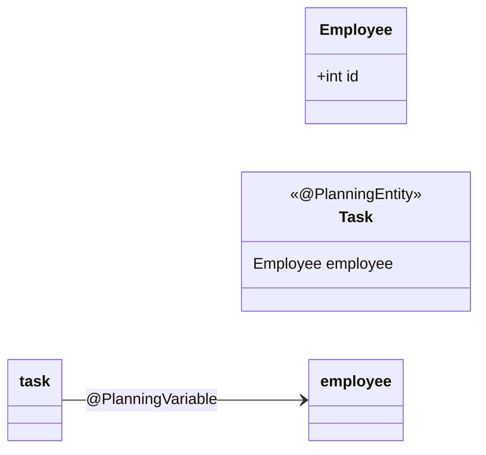

This is an implementation of the task assigment problem in Java using Timefold.

For more advanced examples, check out the [Timefold Quickstarts Repository](https://github.com/TimefoldAI/timefold-quickstarts).
This project leans towards the [Task Assigning Quickstart](https://github.com/TimefoldAI/timefold-quickstarts?tab=readme-ov-file#task-assigning).

## Analysis

### Assumptions

Allowed by organizer: 
- "You can assume that each task is done by just one employee, and one employee is assigned to just one task."

### Domain model

In this case, I have chosen to model the task costs inside the Task class, instead of pulling it to a helper class.

### Constraints

Note: This is implemented in class `TaskAssigningConstraintProvider`, which contains some additional documentation.

- HARD: Leave no task unassigned
- HARD: No employee should be assigned twice
- SOFT: Minimize cost

## Results

Score:0hard/-441soft (so total cost of 441)

Task <-> Employee assignment

| Task | Employee | Cost |
|------|----------|------|
| 0 | 68 | 2 |
| 1 | 41 | 9 |
| 2 | 77 | 4 |
| 3 | 28 | 3 |
| 4 | 61 | 3 |
| 5 | 17 | 4 |
| 6 | 45 | 6 |
| 7 | 16 | 5 |
| 8 | 92 | 7 |
| 9 | 85 | 2 |
| 10 | 57 | 4 |
| 11 | 88 | 3 |
| 12 | 40 | 5 |
| 13 | 30 | 4 |
| 14 | 6 | 4 |
| 15 | 66 | 4 |
| 16 | 43 | 4 |
| 17 | 0 | 3 |
| 18 | 72 | 2 |
| 19 | 94 | 2 |
| 20 | 10 | 3 |
| 21 | 64 | 2 |
| 22 | 12 | 3 |
| 23 | 55 | 2 |
| 24 | 24 | 5 |
| 25 | 63 | 5 |
| 26 | 69 | 3 |
| 27 | 42 | 5 |
| 28 | 74 | 2 |
| 29 | 21 | 5 |
| 30 | 9 | 6 |
| 31 | 65 | 2 |
| 32 | 29 | 5 |
| 33 | 4 | 2 |
| 34 | 27 | 8 |
| 35 | 1 | 3 |
| 36 | 62 | 2 |
| 37 | 7 | 3 |
| 38 | 98 | 4 |
| 39 | 39 | 3 |
| 40 | 97 | 6 |
| 41 | 76 | 4 |
| 42 | 19 | 9 |
| 43 | 86 | 7 |
| 44 | 32 | 8 |
| 45 | 82 | 3 |
| 46 | 25 | 3 |
| 47 | 31 | 5 |
| 48 | 2 | 2 |
| 49 | 48 | 5 |
| 50 | 14 | 6 |
| 51 | 53 | 3 |
| 52 | 13 | 8 |
| 53 | 37 | 3 |
| 54 | 58 | 4 |
| 55 | 73 | 1 |
| 56 | 50 | 3 |
| 57 | 78 | 8 |
| 58 | 83 | 7 |
| 59 | 20 | 4 |
| 60 | 90 | 7 |
| 61 | 75 | 4 |
| 62 | 22 | 2 |
| 63 | 96 | 8 |
| 64 | 87 | 5 |
| 65 | 11 | 3 |
| 66 | 56 | 7 |
| 67 | 38 | 2 |
| 68 | 3 | 4 |
| 69 | 15 | 4 |
| 70 | 34 | 3 |
| 71 | 91 | 2 |
| 72 | 46 | 9 |
| 73 | 89 | 3 |
| 74 | 26 | 4 |
| 75 | 81 | 4 |
| 76 | 35 | 6 |
| 77 | 5 | 3 |
| 78 | 95 | 10 |
| 79 | 79 | 5 |
| 80 | 60 | 5 |
| 81 | 71 | 4 |
| 82 | 23 | 2 |
| 83 | 54 | 4 |
| 84 | 8 | 7 |
| 85 | 80 | 6 |
| 86 | 84 | 2 |
| 87 | 70 | 3 |
| 88 | 18 | 4 |
| 89 | 47 | 3 |
| 90 | 51 | 2 |
| 91 | 52 | 5 |
| 92 | 49 | 8 |
| 93 | 33 | 2 |
| 94 | 44 | 3 |
| 95 | 36 | 13 |
| 96 | 93 | 6 |
| 97 | 59 | 7 |
| 98 | 67 | 4 |
| 99 | 99 | 4 |

### Alternative result

When we don't limit employees to only do 1 task:

Score:0hard/-254soft

## Tech

### Technologies used

- [Timefold Solver](https://docs.timefold.ai/timefold-solver/latest/introduction), an Open Source AI Solver.
- [JBang](https://www.jbang.dev/documentation/guide/latest/index.html), a tool which helps create single Java file scripts with dependencies.

### Running the application

- You need to install JBang.
- Go to the correct folder.
- Execute `jbang Dec03TaskAssigning.java`

